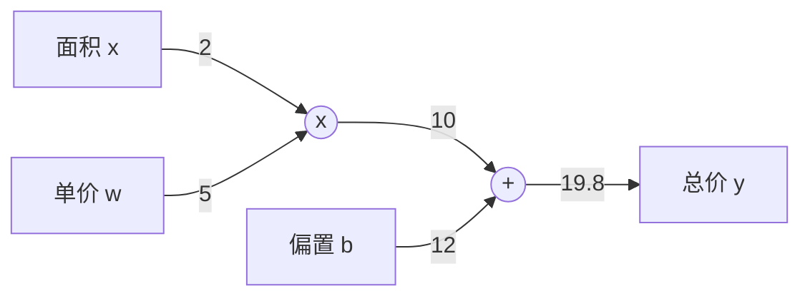
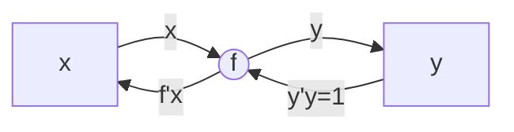

# Pytorch 基础

官网 https://pytorch.org/

官方教程 https://pytorch.org/tutorials/

官方文档 https://pytorch.org/docs/stable/index.html


## 1. Tensor 

Tensors 类似于 NumPy 的 ndarrays ，同时 Tensors 可以使用 GPU 进行计算。

## 2. Tensor 的创建

指定形状，构造一个随机的张量


```python
x = torch.rand(2, 3)
print(x)
```


构造一个全为0的张量，并指定其数据类型是

```python
x = torch.zeros(4, 3, dtype=torch.long)
print(x)
```


根据已有数据构造张量

```python
x = torch.tensor([1, 2.])
print(x)
```


基于已有张量创建一个同形状的张量。

```python
x = x.new_ones(5, 3, dtype=torch.double)
# new_* methods take in sizes
print(x)
x = torch.randn_like(x, dtype=torch.float)
# override dtype!
print(x)
```


Tensor.size() 是一个元组


## 3. Tensor的操作


索引

```python
x = 
```


变形

```python
x = torch.randn(4, 4)
y = x.view(16)
z = x.view(-1, 8) # the size -1 is inferred from other dimensions
print(x.size(), y.size(), z.size())
```


取值

```python
x = torch.randn(1)
print(x)
print(x.item())
```


形状

```python
x = torch.randn(2, 3)
print(x.size())
```


加法

```python
y = torch.rand(5, 3)
print(x + y)
```


```python
print(torch.add(x, y))
```


```python
y.add_(x)
print(y)
```


注意 任何使张量会发生变化的操作都有一个前缀 '_'

x.copy_(y)

x.t_()


## 4. 自动求导


$$
\frac{\partial y}{\partial x} = \frac{\partial y}{\partial t} \frac{\partial t}{\partial x}
$$


数据流图，计算图

节点（node）代表对数据所做的某种运算或操作

边（edge）代表从一个节点传入另一个节点的实际数值


例如：

超市今天办活动，商品一律9折。去超市买了2个苹果，3个橘子。苹果单价5元，橘子单价4元。一共花了多少钱。


$$
y = w*x+b
$$





图中从左到右是一种正向传播，即从输入到输出的传播过程


计算图的优点，

局部计算，同层级节点间的计算是独立的，各节点只需要考虑自己相关的计算，不用考虑全局。

便于使用反向传播求导。


若想知道苹果价格的变化对总价的影响，即求总价关于苹果单价的导数，





```
tensor(data, dtype=None, device=None, requires_grad=False) -> Tensor
 
参数:
    data： (array_like): tensor的初始值. 可以是列表，元组，numpy数组，标量等;
    dtype： tensor元素的数据类型
    device： 指定CPU或者是GPU设备，默认是None
    requires_grad：是否可以求导，即求梯度，默认是False，即不可导的
```


https://pytorch.org/docs/stable/generated/torch.tensor.html?highlight=tensor#torch.tensor


如果将其属性 .requires_grad 设置为 True，则会开始跟踪针对 tensor 的所有操作。完成计算后，可以调用 .backward() 来自动计算所有梯度。该张量的梯度将累积到 .grad 属性中。

调用 .detach()可以停止 tensor 历史记录的跟踪，它将其与计算历史记录分离，并防止将来的计算被跟踪。

要停止跟踪历史记录（和使用内存），还可以将代码块使用 with torch.no_grad(): 包装起来。在评估模型时，这是特别有用，因为模型在训练阶段具有 requires_grad = True 的可训练参数有利于调参，但在评估阶段我们不需要梯度。

Tensor 和 Function 互相连接并构建成计算图。它保存整个完整的计算过程的历史信息。每个张量都有一个 .grad_fn 属性保存着创建了张量的 Function 的引用，（如果用户自己创建张量，则g rad_fn 是 None ）。


```
import torch

x = torch.tensor(2., requires_grad=True)
w = torch.tensor(3., requires_grad=True)
b = torch.tensor(4., requires_grad=True)

h = w * x
y = h + b

print(x.requires_grad)
print(y.requires_grad)

y.backward()

print(x.grad)
print(y.grad)

print(x.grad_fn)
print(h.grad_fn)
print(y.grad_fn)
```


